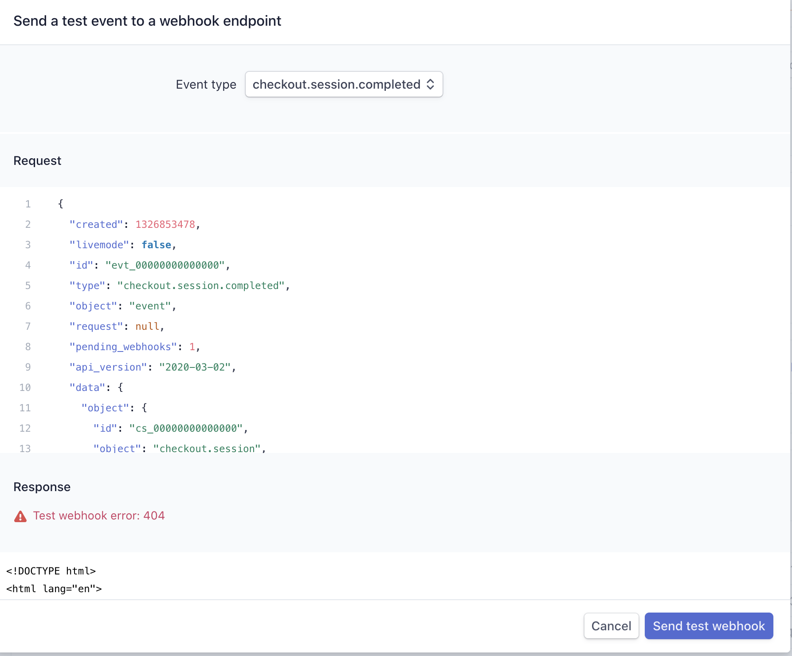
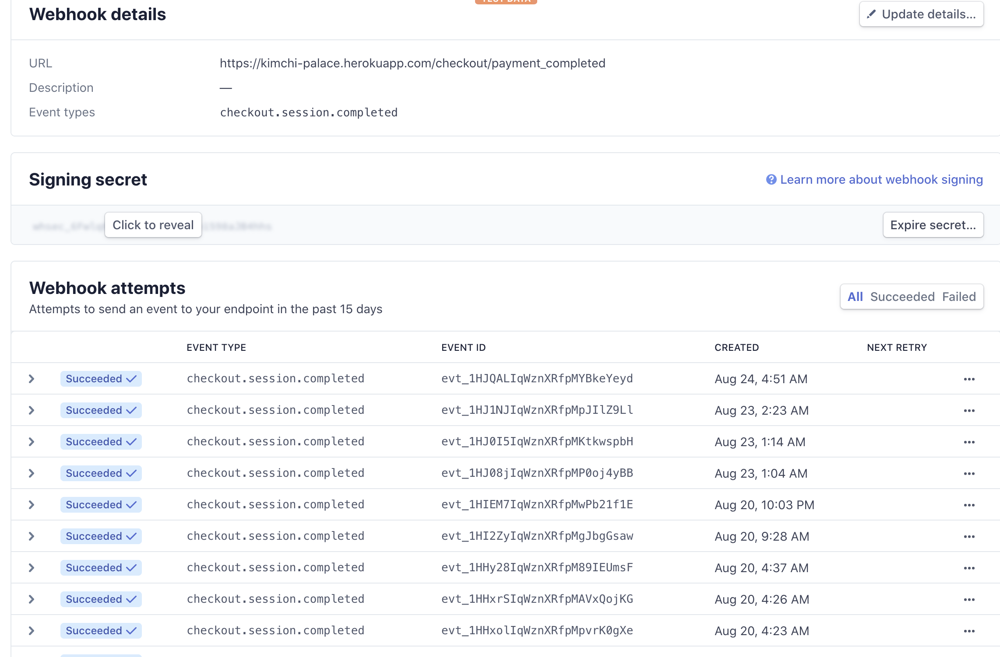

# Full Stack Frameworks with Django
### Welcome to Kimchi Palace

[Kimchi Palace](https://kimchi-palace.herokuapp.com/)<br>
[My Github Page](https://github.com/suchan5/Project-4)

This website is designed and developed as an e-commerce website for the site owner to sell their home-made style Kimchi, and for the external users who are interested in buying their Kimchi.

It comprises of three main sections which are to view all the available Kimchis, to create reviews and leave comments, and to make online payment to purchase the products after siging up and logging in.


# Technologies used
* HTML5 - It was used to build the structure of the website.
* CSS3 - It was used to give design effects and style to the website. Also, media query was used for responsive design purpose.
* JavaScript - It was used to make the website more dynamic and interactive.
* Python + Django - Python was used to build the full-stack web application with a relational database.
* Postgres - Relational database, Postgres, was used to design a database structure and to store data.
* [Cloudinary](https://cloudinary.com/) - It was used for image uploading function. Images are stored in Cloudiary's cloud.
* [Stripe](https://stripe.com/) - It was used for online payment processing function.
* [Google Fonts](https://fonts.google.com/) - It was used for different typographies for design effects.
* [jQuery 3.5.1](https://jquery.com) - It was used to make it easier to use JavaScript.
* [Bootstrap 4.5.2](https://getbootstrap.com) - It was used for structure and style for the website with responsive design for different media sizes.
* [Font Awesome](https://fontawesome.com/) - It was used for concise and intuitive design effect by using icons.


# Data Structure


# Structure of the website
[Wireframe](#)
#### Each page is intuitive and interactive which makes it easier for users to explore the content throughout the website.
##### 'Main' page 
'Main' page is the first page the users see when they access the domain address. Jumbotron and Kimchi image is used as background in order to give a direct idea of what this e-commerce website is selling. Also, a navbar is located at the head of the page to guide users through navigation. A search engine is available at the navbar where users can search for a product they want to look for. Subnavbar is also located and accessble from every page so that users can login anytime to make purchases. 
##### 'All Kimchis' page
'All Kimchis' page is where all the products are available for viewing. Users can search by search terms or by filtering main ingredients using the dropdown bar.
##### 'Kimchi Details' page
'Kimchi Details' page is where users can view the details of the product, such as price, main ingredients, manufacture date and other relevant specifications. 'Continue Shopping' and 'Add to cart' buttons are placed to make shopping easier for the users.
##### 'Shopping Cart' page (authentication required)
'Shopping Cart' page is where users can view the products they selected for future purchases. Users can update the purchase quantity or delete the item from the shopping cart by simply clicking the buttons. Also, 'Continue Shopping' and 'Add to cart' buttons are placed to make shopping easier for the users.
##### 'My Purchases' (authentication required)
'My Purchases' page is where users can view the history of their past purchases. Upon checking out, users are redirected to this page and can see their purchases.
##### 'Reviews' page
'Reviews' page is where users can create, read, update, and delete their own reviews about the product. Users can also view all the reviews posted by other users to gather personal reviews about the Kimchis before making purchases.
##### 'Review Details' page
'Review Details' page is where users can view the detailed review by clicking from 'Reviews' page. Users can also leave a comment below the review to share information or ideas.
##### 'Authentication' pages - login, logout, signup 
Login, logout, SignUp pages can be accessed via subnavbar.


# UI/UX Design
This website is created with a focus on UI/UX that is:
1. Simple & clear :
- This is achieved by giving consistency in design throughout the website. Also, I gave enough spacing (padding and margin) for better readability of the content.

2. Easy to use :
- Responsiveness : For example, font size is responsive to different device sizes so that users can use the website even on smaller devices.
- Placeholder, icons, buttons, flash messages are added to guide the users.

3. Presentable :
- A clean and theme-related image (Kimchi) was chosen and incorporated as the background to improve the overall design.
- To give the texts a better visibility over the white background, I have added a translucent grey box (in 'Reveiw details' page and authentication pages), making the content more readable.
- Images are uniform in size and are not pixelated even in different media sizes.
- For colors, black and green were chosen as two main colours in order to give consistency in design.
- Preview images of the reviews are available on the 'Review Details' page for intuitive effects.


## Features and functions added for improved UI/UX

#### Navbar : 
- A navbar is added at the top of the website for users' direct access to each sections. 
- Navbar shows the links to the two main pages ('All Kimchis' and 'Reviews') so that users can access to view the products, or to post a review and read other users' reviews.
- Shopping cart is located in the navbar for users to access whenever they want to make purchases.
- Navbar is accessible from every page.

#### Sub-navbar :
- Sub-navbar is located right above the navbar with login, logout, and SignUp link. 
- A static message shows the status of login. (If a user is not logged in, it shows "Login to make purchase". If the user, for example "user1", is logged in, it shows "Welcome user1".)
- When a user is succesfully logged in, login link changes to logout link. 
- When a user is succesfully logged in, SignUp link changes to My Purchase link

#### Giving guidance :
- For any action performed by a user such as creating, editing and deleting of the reviews or upon succesfully checking out, a flash message appears to indicate that the action is performed succesfully. (Flash messages disappear after some time.)
- Shopping cart shows the number of items currently in the user's shopping cart. (The number of items in the shopping cart becomes 0 upon succesful checkout.)
- 'Shopping cart' page shows a message "※ No items in your shopping cart" when the shopping cart is empty.
- 'My purchase' page shows a message "※No past purchases" when there is no history of purchases.
- Total payable amount changes according to the purchase quantity in the shopping cart.

#### Search function :
- Users can search for Kimchis with search terms.
- Users can use search terms regardless of the upper case or lower case.
- Results will be shown for both scenarios whether the search term is in full or in partial strings.
- Placeholders give users an idea of what to fill in the search engine.
- Users can filter the products by main ingredients.
- A message located below the search engine in the 'All Kimchis' page shows how many search results are available.

#### Pictures of Kimchis can be enlarged :
- For 'All Kimchis' page, the product pictures can be enlarged upon mouseover to give users a better interactive experience.

#### Preview of images when submitting reviews :
- When submitting or updating the reviews of their own, users can view the preview of the images which they are going to post or edit.

#### Commenting function :
- Users can freely leave comments on both their own or the others' reviews to share opinions.

#### Scroll to the top button:
- When the user scrolls down 200px from the top of the document, a button shows to enable the users to scroll back to the top.

#### Redirect :
- For example, in 'Reviews' page, users are redirected to the same review page where they left off after performing an action. For example, a user tries to update his/her review but decides to cancel, he/she is redirected back to the review where the user last left off. 


## Features left to be implemented
- While updating an existing review, the uploaded image disappears once users clicks to edit their own reviews. I want to make improvements such that it keeps the uploaded image during editing.
- Currently in 'My Purchase' page, all of the past purchase history is available for viewing. I want to implement a function which only shows the most recent purchases upon succesful checkout.
- I want to achieve viewing quantities purchased in 'My Purchase' page.


# Responsive Design
The main purpose of the test on the responsive design is to ensure that the website works well and looks organized in different media sizes. It was acheived by using Bootstrap, media query, and 'Inspect' function from Google Chrome.


# Deployment 
Kimchi Palace website is coded and developed in Gitpod, and deployed using a cloud based hosing platform, Heroku.

1. Install dependencies
```html
pip3 install gunicorn
pip3 install psycopg2
pip3 install Pillow
pip3 install whitenoise 
pip3 install dj_database_url
```
2. Add Whitenoise to MIDDLEWARE in 'settings.py'
```html
MIDDLEWARE = [
.....
'whitenoise.middleware.WhiteNoiseMiddleware'
]
```
3. Make sure to have a .gitignore file
4. Login to Heroku
```html
heroku login -i
```
5. Create an Heroku app. It must be unique and must avoid underscore
```html
heroku create <app name>
```
6. Double check that the Heroku app created succesfully.
```html
git remote -v
```
7. Copy environment variables over
1) Open .env file in Gitpod.
2) Go to Heroku website > Go to my app which just created > Settings > Reval Config Vars
3) Copy the exported variables in .bashrc over to the Config Vars

8. Create Procfile in Gitpod. It must be in the same directory as 'manage.py'
9. Add Command to Procfile
```html
web: gunicorn <PROJECT_FOLDER>.wsgi:application
```
Name of my project folder is 'KimchiProject' so it should be as below:
```html
web: gunicorn KimchiProject.wsgi:application
```
10. Update ALLOWED_HOSTS inside 'settings.py'
Add the domain name without the HTTPS of the heroku app into the ALLOWED_HOST inside 'settings.py'
```html
E.g. https://kimchi-palace.herokuapp.com/ → kimchi-palace.herokuapp.com
```
11.Generate requirements.txt for Heroku to know what packages install.
```html
pip3 freeze --local > requirements.txt
```
12. Add STATIC_ROOT to 'settings.py' for Whitenoise to work
```html
STATIC_ROOT = os.path.join(BASE_DIR, 'staticfiles')
```
Also need to input below to the templates
```html

```
13. Deploy to Heroku
Firstly, git push to Github repository
```html
git add .
git commit -m "your commit message"
git push 
```
and then push to Heroku
```html
git push heroku master
```
14. Setting up the database for Heroku app - Postgres database.
Check the URL to the database
```html
heroku config
```
Copy the DATABASE_URL when it is shown. We will need this again.

15. Add the DATABASE_URL to .bashrc 
```html
export DATABASE_URL="<database_url>"
```
Mine in .env is like below:
```html
export DATABASE_URL="postgres://
```
16. Change database settings in 'settings.py'
```html
import dj_database_url
```
17. Comment out the existing DATABASES setting in 'settings.py', and paste the below after the commented out lines: 
```html
# DATABASES = {
#     'default': {
#         'ENGINE': 'django.db.backends.sqlite3',
#         'NAME': os.path.join(BASE_DIR, 'db.sqlite3'),
#     }
# }

DATABASES = {'default': dj_database_url.parse(os.environ["DATABASE_URL"])}
```

18. Migrate the database - make sure to restart the terminal and migrate
```html
python3 manage.py migrate
```

19. Commit and push to Heroku
```html
git add .
git commit -m "Updated settings.py"
git push heroku master
```

20. Create a Super User - This is necessary as I have switched to a new database from Sqlite3, it would not have any old data.
```html
python3 manage.py createsuperuser
```

21. Attempt to access admin panel and add in models

#### Errors & differences detected after deployment
##### Stripe webhook : There is an error(404 not found)detected which did not occur when tested in Gitpod.


No issue is noted when sending test webhook before deployment. Whereas after deployment, sending test webhook failed. <br>
Nevertheless, payment is still able to process successfully in deployed app :
<br>


I have tried to fix by setting up the Sites correctly in admin panel with Heroku app domain name as below (without slash at the back):
```html
https://kimchi-palace.herokuapp.com
```
Also, I have added in new webhook at stripes.com and create new endpoint and put the url as :
```html
https://kimchi-palace.herokuapp.com/checkout/payment_completed 
```

However the issue still remains unresolved.


# Testing
#### Testing Purpose
* To ensure that there are no broken images or links.
* To ensure that the website is responsive on different devices.
* To ensure that the website runs well on different browsers.
* To ensure that the website's features and functions all work as intended for users.

I sent the deployed URL to friends and family to test whether the website works responsively without broken images or links in different screen sizes. Also, testing was done on different browsers to ensure that the website runs well.
#### Devices tested 
* Oppo R11
* iPhone XR
* iPhone 6S
* Galaxy S20+
* Galaxy Tab A
* MacBook Pro
* iPad Air 3rd Gen 
* HanSung Computer Ultron 2454C

#### Browsers tested 
* Google Chrome 
* Safari 
* Firefox 
* Internet Exporer 


##### Error detected
In 'update the review' page, users are only able to upload an image at thier second attempt. It is deemed as Clouninary issue.
##### No other error detected, except above Cloudinary error. Testing results are as expected.


## Credit

#### Images
* [Kimchi Factory](https://www.kimchifactory.co.kr/) - for the Kimchi pictures used in 'All Kimchis' page
* [Pixaboy](https://pixabay.com/ko/) - for the Kimchi pictures used in 'Review details' page
* [The Paleo Diet] (https://thepaleodiet.com/what-is-kimchi-and-is-it-paleo) - for the Kimchi pictures used in 'Review details' page

#### Ackowledgement
* [W3schools](https://www.w3schools.com/howto/tryit.asp?filename=tryhow_js_scroll_to_top) - for the button to scroll up to the top
* [Stackoverflow](https://stackoverflow.com/questions/60936594/django-login-button-turned-to-be-logout-after-user-logged-in) - for login button turned to be logout after user logged in

## Disclaimer
This website is created for educational purpose only.


